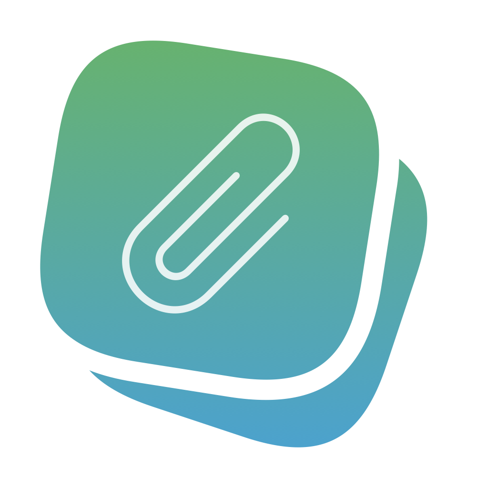

<p align="center">
  
</p>

<h1 align="center">Clipback</h1>

<p align="center">
  <strong>A lightweight, native, and privacy-first clipboard manager for macOS.</strong>
</p>

<p align="center">
  <a href="https://github.com/nhanchaukp/clipback"></a>
  <a href="https://swift.org"></a>
  <a href="LICENSE"></a>
  <a href="https://github.com/nhanchaukp/clipback/releases"></a>
  
  
</p>

---

## 📖 Overview

**Clipback** is a modern macOS clipboard history manager built with pure **SwiftUI** and **AppKit**. Designed with speed, aesthetics, and privacy in mind, Clipback runs seamlessly in your menu bar with a Raycast/Spotlight-style floating HUD, giving you instant access to your copied texts, rich formatting, images, color codes, URLs, and files.

---

## ✨ Features

- 📋 **Multi-Format Clipboard History**:
  - **Plain Text**: Captures all plain text clips.
  - **Rich Text**: Retains formatted text (`RTF` / `HTML`).
  - **Images**: Stores and displays image thumbnails (`PNG`, `JPEG`, `TIFF`) with quick previews.
  - **Color Codes**: Automatically detects `HEX`, `RGB`, and `HSL` formats with interactive color swatches.
  - **Links & Files**: Categorizes web links (`http`/`https`) and local file references.

- 🔍 **Instant Search & Type Filtering**:
  - Real-time search by keyword or substring.
  - Quickly filter items by type (All, Text, Rich Text, Images, Colors, Links, Files).
  - Dedicated view for pinned favorites.

- ⚡ **Global Hotkey & Direct Paste**:
  - Summon the floating panel anytime with a customizable system-wide shortcut (default: <kbd>⌘</kbd> + <kbd>Shift</kbd> + <kbd>V</kbd>).
  - Automatically paste the selected item directly into the active application via macOS Accessibility API.

- 🔒 **Privacy & Password Manager Concealment**:
  - Automatically respects privacy markers (`org.nspasteboard.ConcealedType`, `org.nspasteboard.AutoGeneratedType`, `TransientType`).
  - Ignores data copied from password managers such as **1Password**, **Bitwarden**, **KeePassXC**, and macOS Keychain.
  - Exclude specific applications by Bundle ID.
  - One-click pause/resume clipboard monitoring.

- 👁️ **On-Device OCR (Live Text)**:
  - Powered by Apple's Vision framework to extract text from copied images locally without sending data to external servers.

- 📷 **QR Code Scanner**:
  - Detects and decodes QR codes embedded within copied images automatically, allowing you to copy decoded URLs or content directly.

- 🎨 **Modern Native Design**:
  - Floating HUD window with native macOS frosted glass vibrancy (`NSVisualEffectView`).
  - Menu bar integration with adaptive color or monochrome icons.

- 📌 **Pinning & History Retention Management**:
  - Pin important clips to prevent them from being removed.
  - Retention policies: by item count (up to 1,000 items) or duration (up to 90 days).
  - Optional storage quota limit (MB).

- 🌐 **Multilingual Support**:
  - English and Vietnamese (Tiếng Việt).

- 🚀 **System Integration**:
  - Launch at login support via `SMAppService`.
  - Built-in GitHub release update checker.

---

## ⌨️ Keyboard Shortcuts

| Shortcut | Action |
| :--- | :--- |
| <kbd>⌘</kbd> + <kbd>Shift</kbd> + <kbd>V</kbd> | Toggle Clipback Floating Panel (configurable) |
| <kbd>↑</kbd> / <kbd>↓</kbd> | Navigate clipboard items |
| <kbd>Return</kbd> | Copy & paste selected item to active app |
| <kbd>⌘</kbd> + <kbd>C</kbd> | Copy selected item to clipboard without pasting |
| <kbd>⌘</kbd> + <kbd>P</kbd> | Pin / Unpin selected item |
| <kbd>⌘</kbd> + <kbd>⌫</kbd> | Delete selected item from history |
| <kbd>⌘</kbd> + <kbd>,</kbd> | Open Preferences / Settings |
| <kbd>Esc</kbd> | Close floating HUD |

---

## 📋 Requirements

- **Operating System**: macOS 14.6 (Sonoma) or later (macOS Sequoia compatible)
- **Architecture**: Universal (Apple Silicon `arm64` & Intel `x86_64`)
- **Permissions**:
  - **Accessibility**: Required for simulating paste events (<kbd>⌘</kbd> + <kbd>V</kbd>) into target applications.

---

## 🛠️ Installation & Building

### Build from Source

1. **Clone the repository**:
   ```bash
   git clone https://github.com/nhanchaukp/clipback.git
   cd Clipback
   ```

2. **Open in Xcode**:
   ```bash
   open Clipback.xcodeproj
   ```

3. **Build & Run**:
   - Select the `Clipback` scheme.
   - Press <kbd>⌘</kbd> + <kbd>R</kbd> to build and run the app.

---

## 🏗️ Architecture & Tech Stack

Clipback is crafted with clean separation of concerns and modern Swift concurrency:

- **UI Framework**: [SwiftUI](https://developer.apple.com/xcode/swiftui/) + [AppKit](https://developer.apple.com/documentation/appkit) for native macOS performance.
- **Image Analysis**: [Vision](https://developer.apple.com/documentation/vision) for on-device OCR and QR code detection.
- **Shortcuts**: [Carbon](https://developer.apple.com/documentation/carbon) APIs for system-wide global key listening.
- **Background Service**: `SMAppService` for login item management.
- **Event Simulation**: Quartz Event Services (`CGEvent`) for seamless auto-paste.

---

## 🤝 Contributing

Contributions, issues, and feature requests are welcome! Feel free to check the [issues page](https://github.com/nhanchaukp/clipback/issues).

1. Fork the Project
2. Create your Feature Branch (`git checkout -b feature/AmazingFeature`)
3. Commit your Changes (`git commit -m 'Add some AmazingFeature'`)
4. Push to the Branch (`git push origin feature/AmazingFeature`)
5. Open a Pull Request

---

## 📄 License

This project is licensed under the **MIT License** - see the [LICENSE](LICENSE) file for details.

Copyright © 2024–2026 **nhanchaukp (Châu Thái Nhân)**. All rights reserved.
